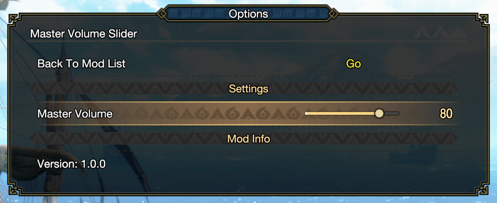

Master Volume Slider is a [Monster Hunter Rise](https://www.monsterhunter.com/rise/) mod that adds a basic master volume slider.

## Configuration

### REFramework Menu

You can adjust the master volume from the REFramework menu.

### Custom In-Game Mod Menu

This mod has [Custom In-Game Mod Menu API](https://www.nexusmods.com/monsterhunterrise/mods/1292) support.

## See also

- [Release notes](docs/release-notes.md)